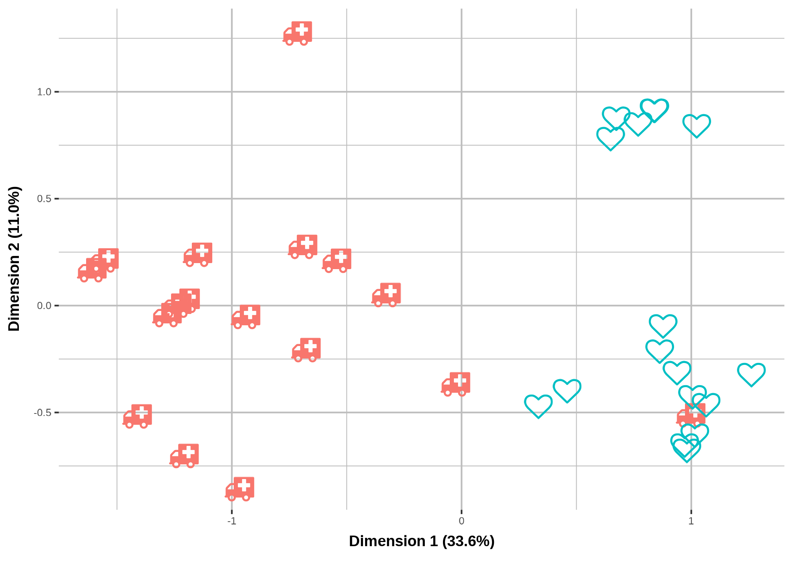
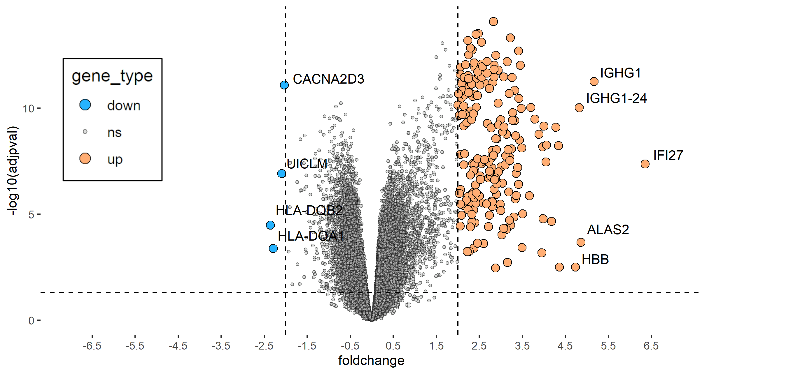

<style type="text/css">
.remark-slide-content {
    font-size: 25px;
    padding: 1em 2em 1em 2em;
}
.left-code {
  color: #777;
  width: 38%;
  height: 92%;
  float: left;
}
.right-plot {
  width: 60%;
  float: right;
  padding-left: 1%;
}
</style>

```{r setup, include=FALSE}
options(htmltools.dir.version = FALSE, echo=FALSE,
        message=FALSE,warning=FALSE,
        fig.dim=c(4.8, 4.5), fig.retina=2, out.width="100%")

knitr::opts_chunk$set(echo = FALSE)

knitr::knit_hooks$set(mysize = function(before, options, envir) {
  if (before) 
    return(options$size)
})
```

# Outline

.columnwide[
  ### 1) [Introduction and motivation](#Introduction)
  ### 2) [Data acquisition](#DataAcquisition)
  ### 3) [QC and Data Explorartion](#QCExploration)
  ### 4) [Gene Selection](#geneSelection)
  ### 5) [Biological Interpretation](#Interpretation)
  ### 6) [Summary](#Summary)
  ### 7) [References and Resources](#References)
]

---

class: inverse, middle, center

name: Introduction

# Introduction and motivation

---

# Finding COVID-related genes

- Biological information is contained in genes. 
- Genes (DNA) express themselves by transcribing their sequence into RNA fragments (transcripts). 
- Knowing which genes express differently between healthy people and COVID patients can help us to understand and cure the disease.

- We introduce some visualizations used in the search for those genes. 
- This is done by sequencing blood samples and comparing the abundance of RNA transcripts in each group: "more expression, more abundance".

---

class: inverse, middle, center

name: DataAcquisition

# Data Acquisition

---
# Data acquisition

```{r}

```

---

# The data for the analysis

- From each blood sample, RNA is extracted and prepared to be sequenced, a process that yields a large number of copies of each RNA fragment.
- Sequenced transcripts are aligned to a reference genome to know which gene is expressing each transcript. It is like reconstructing a puzzle.
- Gene expression is quantified by counting the numberof fragments aligned with each gene.
- This is summarized in the counts' matrix, with one row per gene and one column per sample.

---

class: inverse, middle, center

name: QCExploration

# QC and Data Explorartion


---

# Plots for quality checking

_How can we know if the data generation/acquisition process has worked well_?: **Not a trivial answer**

.pull-left[
```{r}

```
]

.pull-right[
```{r}
knitr::include_graphics("figures/dendograma.png")
```
]

<small>
- Smples tend to be more similar within groups than between groups. 
- PCA or Hierarchical clustering are used to check this assumption.
</small>


---

class: inverse, middle, center

name: geneSelection

# Gene Selection

---
# Gene selection

.pull-left[
```{r}

```
<small>
- A statistical test allows selecting significant differentially expressed genes. 
- The *volcano plot* shows statistical versus biological significance
</small>
]

.pull-right[
```{r}
knitr::include_graphics("figures/pheatmap_transp.png")
```
<small>
- *Heatmap* displays the expressions of selected genes in a grid. 
- The color scale:intensity of gene expression. 
  </small>
]

---

class: inverse, middle, center

name: Interpretation

# Biological Interpretation

---

# Interpreting the results

- Genes are annotated in different knowledge databases by terms or categories describing their biological role. 

- The distribution of annotations of selected genes is compared with the distribution of the same annotations in the genome. This allows determining which biological processes might be associated with our gene list.

- We end up linking those differentially expressed genes that are included in the most represented biological categories using a network plot (bottom left-hand figure

---
#  Plots to guide interpretation

.pull-left[
```{r}
knitr::include_graphics("figures/dotplot_transp.png")
```
]

.pull-right[
```{r}
knitr::include_graphics("figures/cnetplot_transp.png")
```
]
---

class: inverse, middle, center

name: summary

# Summary

---

# In summary

- Genes that _express_ differently between biological conditions can be useful to characterize the difference between them.

- Gene expression can be quantified  using high throughput sequencing.

- Expression differences between conditions can be established using statistical and bioinformatic methods.

- General and specialized tools are useful to visualize data, results and and to guide biological interpretation.

---

class: inverse, middle, center

name: References

# References and Resources

---

# References

- Analyses based on data from: Arunachalam et al. _Systems biological assessment of immunity to mild versus severe COVID-19 infection in humans_ .Science. 2020 Sep 4;369(6508):1210-20. doi: 10.1126/science.abc6261.

- Inphography available at: https://zenodo.org/record/7195043#.Y1AvyNJByRS