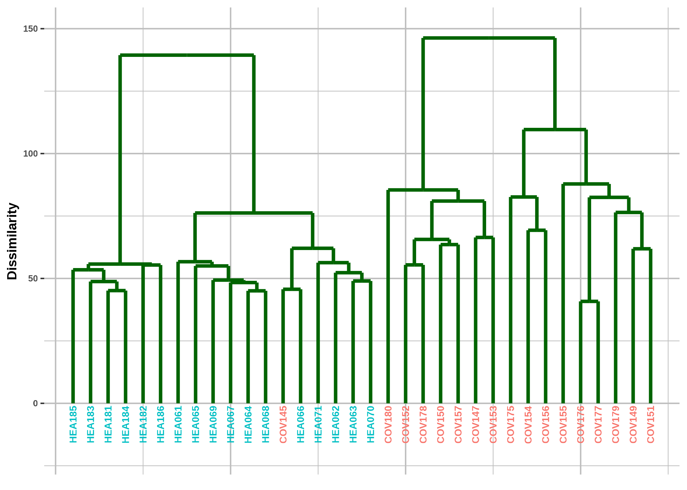

# Infographics Data visualization on Bioinformatics.

## Introduction

This repository contains a simplified analysis of RNA-Seq data with R and Bioconductor. The objective is to show a workflow in a simple way that can serve as the basis for an infographic that will be made with the [GRBio](http://grbio.upc.edu) group.

Some graphics than you can see in the [infographics](https://www.canva.com/design/DAFDMgmnNBw/ArYoC2fGU1OAQYMg_X0jAA/edit?utm_content=DAFDMgmnNBw&utm_campaign=designshare&utm_medium=link2&utm_source=sharebutton) are below.

## Boxplot of log counts

## MDS plot

The library [emojifont](https://cran.r-project.org/web/packages/emojifont/vignettes/emojifont.html) was used for this plot

## Dendogram

## Volcano plot

## Heatmap

## Dotplot

## CNET plot

